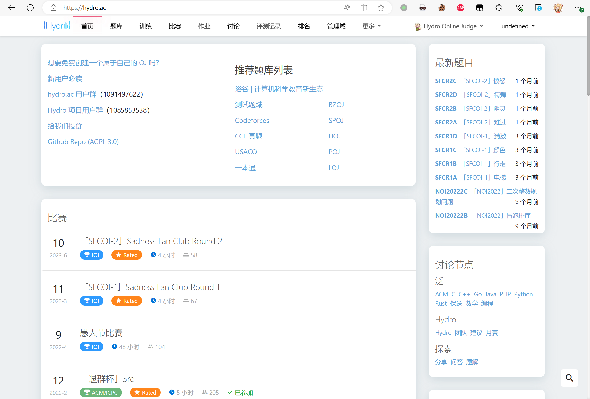
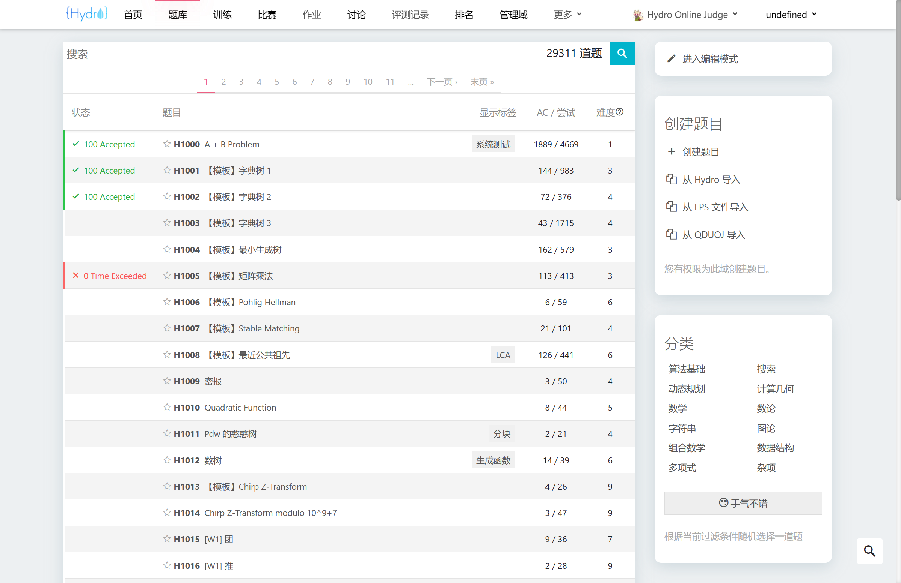
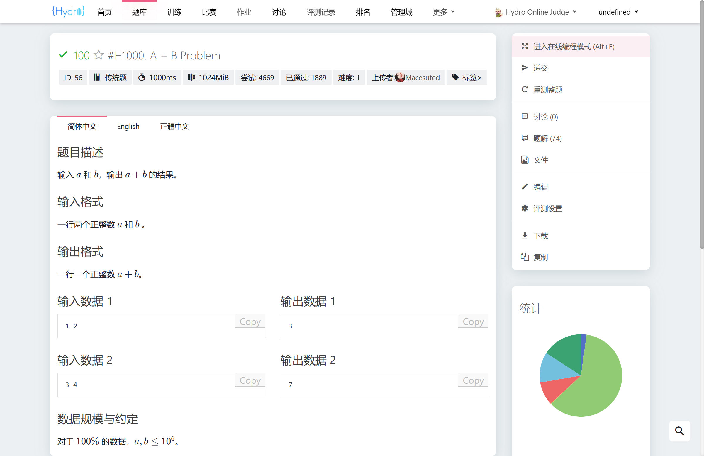
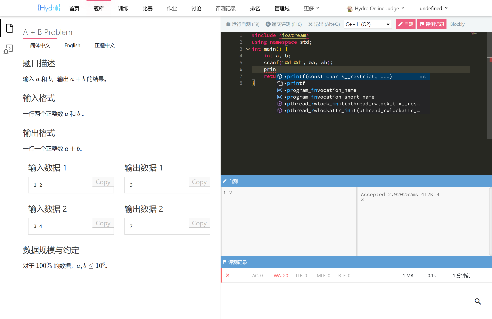
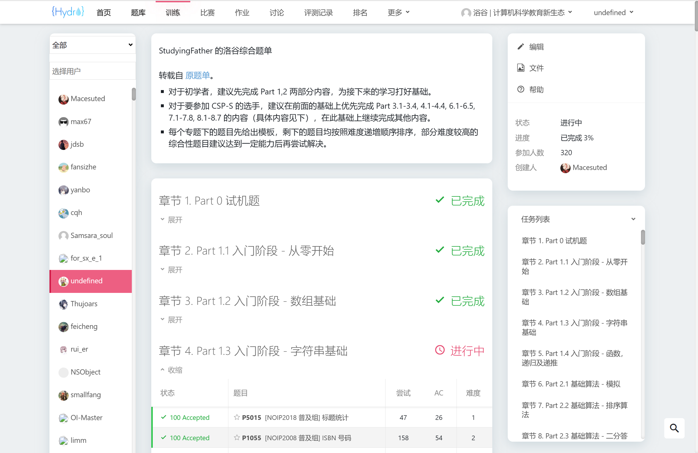
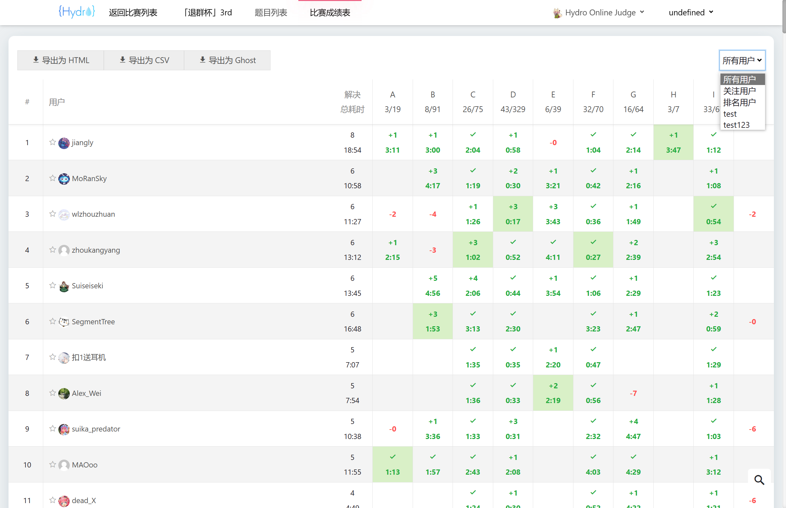
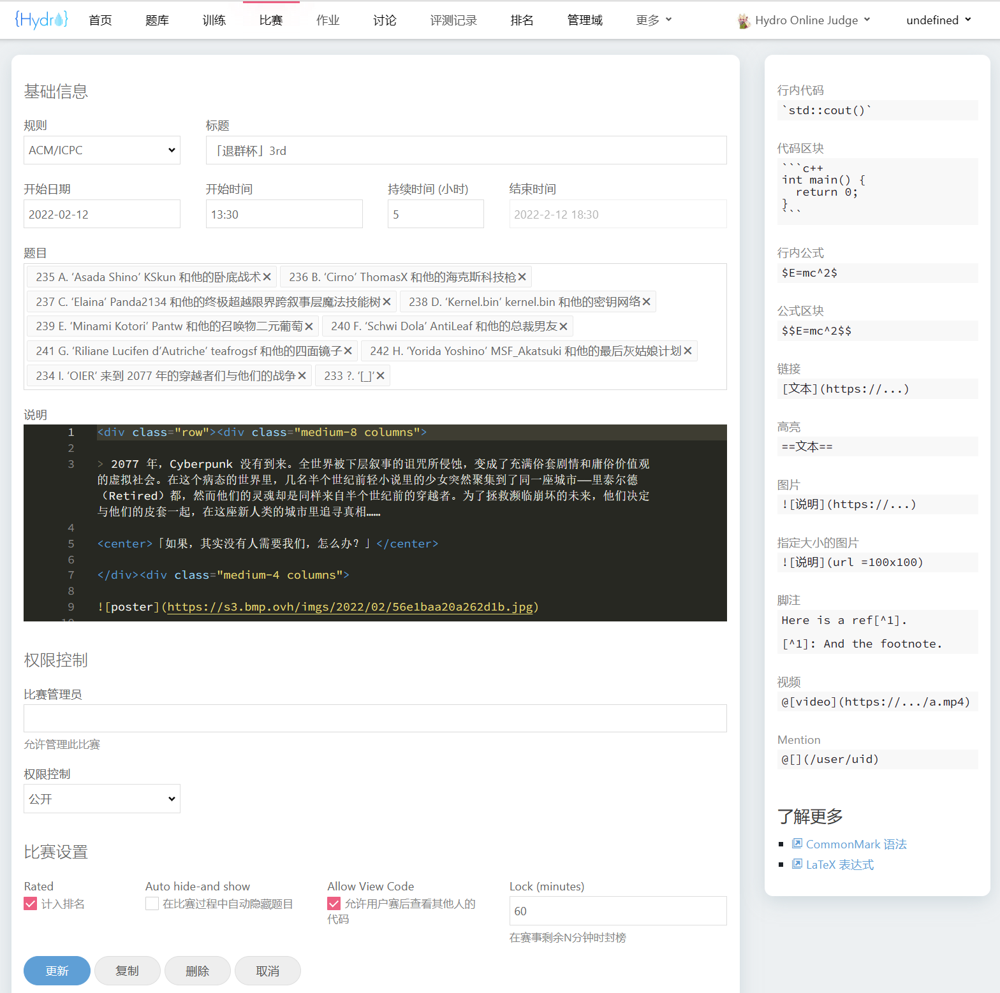
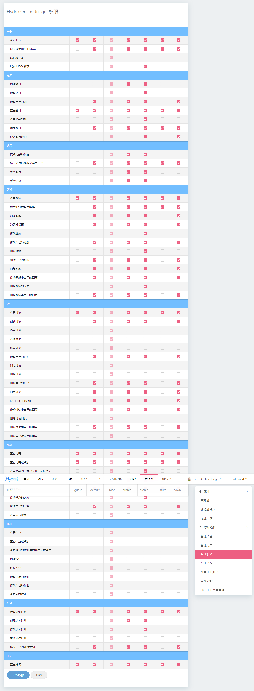

- **Secure**: Uses Linux container technologies (read-only filesystem, namespaces, and cgroups) for isolation, effectively preventing sandbox-escape attacks.
- **Efficient**: Employs sandbox-reuse technology for exceptional judging performance.
- **Extensible**: Supports a wide range of official and community plugins.
- **Powerful**: Combined with the Judge module (or standalone HydroJudge), it supports SPJ (Special Judge), interactive problems, output-only tasks, file I/O, and more.
- **Customizable**: Offers granular control over permission nodes and system settings.
- **Beginner-friendly**: No source code modifications required. Manage your site through a user-friendly interface.
- **Community-driven**: Actively maintained by the development team and the community.

- **Migrating from HustOJ?** Export problems as FPS files and import them using the [fps-importer plugin](/docs/Hydro/plugins/fps-importer).
- **Migrating from QDUOJ?** Use the `import-qduoj` plugin to import zip-format problem exports.
- **Migrating from Vijos / SYZOJ / HustOJ / UniversalOJ?** The [migrate plugin](/docs/Hydro/plugins/migrate) can import your existing data directly.

## Feature Comparison

Hydro supports many advanced problem types out of the box. You can explore and download sample problems at [hydro.ac/d/system_test/p](https://hydro.ac/d/system_test/p) (Login required).

The table below compares Hydro with other popular Online Judge systems (assuming no source code modifications).

```
+: Supported
=: Partially supported
?: Unknown
-: Not supported
```

| Feature | Hydro | HustOJ | SYZOJ[^7] | QDUOJ | Vijos |
| :---: | :---: | :---: | :---: | :---: | :---: |
| Installation | One-click script | One-click script | Manual setup | Docker | Docker |
| Database | MongoDB | MySQL | MariaDB | Postgres | MongoDB |
| Test Data Storage | Local/S3 [^1] | Local | Local | Local | Database |
| Multiple Judges | + | =[^5] | =[^8] | = | + |
| Test Data Sync | On-demand fetch | Full sync | Full sync | Full sync | On-demand fetch |
| Contests | ACM/OI/IOI/Leduo | ACM/OI | ACM/OI/IOI | ACM/OI/IOI | ACM/OI |
| Scoreboard Freeze | + | + | - | - | - |
| Assignment Features | + | + | - | - | + |
| Customizable Compile/Language | + | =[^9] | - | - | + |
| Granular Permissions [^4] | + | = | - | - | + |
| Training Plans (Problem Lists) | + | + | -[^6] | - | + |
| Teams | + [^2] | - | - | - | + |
| Hack | + | - | - | - | - |
| Special Judge | + [^3] | + | + | - | = |
| Subtasks | + | - | + | - | - |
| Interactive Problems | + | - | + | - | - |
| Remote Judge | CF/SPOJ/UOJ/POJ/Luogu | HDU/PKU | - | - | - |
| Problem Import | fps/syzoj/qduoj/hydro | fps/qduoj | syzoj | fps/qduoj | - |

[^1]: S3 refers to any S3-compatible service, such as Tencent Cloud COS, Alibaba Cloud OSS, etc.
[^2]: Users can create "Domains" with full administrative control. Domains share user account data but remain logically isolated.
[^3]: Supports all major SPJ formats.
[^4]: Refers to fine-grained permission control beyond a simple user/admin binary.
[^5]: Complex configuration; data requires manual synchronization.
[^6]: Available in some community-modified versions.
[^7]: SYZOJ and Lyrio (formerly syzoj-ng, used by loj.ac) are distinct systems. SYZOJ cannot natively import loj.ac problems; Lyrio lacks contest features.
[^8]: Manual data synchronization required.
[^9]: Only specific compile parameters can be modified; adding a language requires source code changes.

## Screenshots










## Get Started

Click [Deploy](/docs/Hydro/install/) to set up your own Online Judge!

