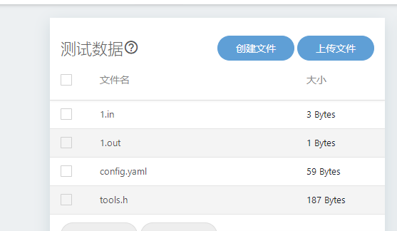
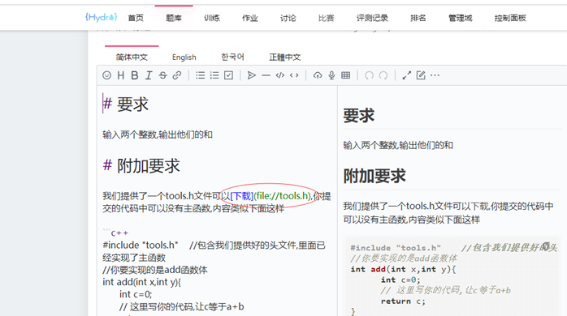
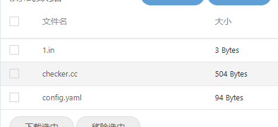
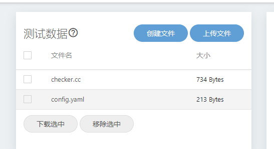
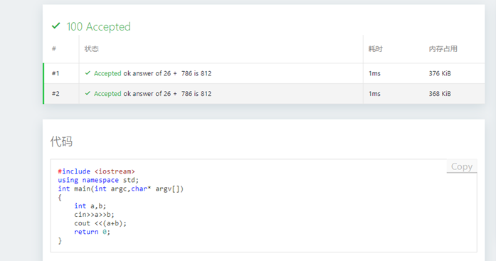
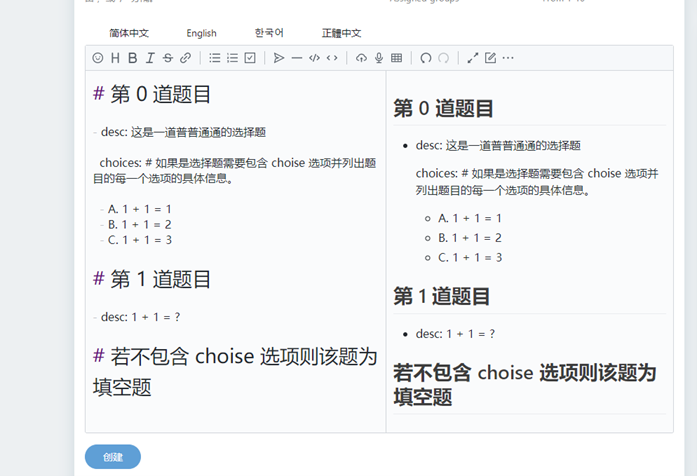
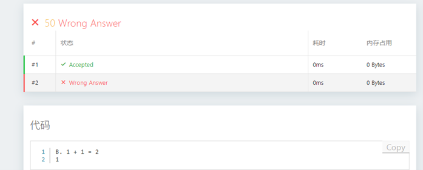

Author: laomai  
qq: 29985091  
Website: http://82.157.98.222:8888/  
Date: 2022/03/16  

This article records the author's practical experiments while using Hydro, and I hope it helps everyone. It includes the following content:

0. Hydro problem storage format  
1. Creating the simplest OJ problem  
2. OJ problems with custom header files (function-interactive problems)  
3. Semi-automatic checker problems (no need to input expected output manually)  
4. Fully checker-based problems (no need to input input/output data manually)  
5. Specifying input and output files  
6. Multiple subtasks  
7. Objective problems (fill-in-the-blank and multiple-choice with standard answers)  

## 0. Hydro problem storage format

If you want to prepare problems locally and then upload them in batches, the format below should help.  
Each problem should use its own directory, with the directory name as the problem number such as 1, 2, 3, 4, etc.  
Each problem directory usually contains the following:  
`problem_zh.md` This file is the problem content, i.e., problem statement, in markdown format.  
`problem.yaml` file. This is the problem configuration information, such as title and tags.  
`testdata` subdirectory, corresponding to files in the test data section on the website.  
It must contain at least one `config.yaml` file to describe judge type; see examples below for details.  
If a problem has test cases, each case should provide at least one `.in` file and one output file (some test types do not require this; see details below).  
`additional_file` subdirectory stores extra files for contestants, such as header files, images, PDF documents, etc. In the problem markdown document, you can provide download links like this: `[text](file://xxx.txt)`

Below are the manual steps for entering various problem types, i.e., operations after logging in and clicking create problem, as shown below:
 

Assume all problem statements use the markdown document below:

    # 要求
    
    输入两个整数，输出他们的和
    
    # 样例
    
    ```input1
    123 500
    ```

    ```output1
    623
    ```

## 1. Create the simplest OJ problem

Problem URL: http://82.157.98.222:8888/p/P10000

1. After creating a new problem, edit the statement content, enter problem ID and title, then click Create, as shown below.
2. You will then see the interface below. Click Create File, with filename `1.in`, representing input for case 1.
3. Edit `1.in` content as two integers, e.g., 2 and 3, separated by space, as shown below, then click Confirm.
4. Similarly create a `1.out` file with content 5. Note the numeric index must match the `.in` file. The created file list should look like this.


5. Now input and expected output for the first case are ready, and the problem can be solved.
6. AC code for this problem:

```cpp
#include <iostream>
using namespace std;
int main(int argc,char* argv[]){
    int a,b;
    cin>>a>>b;
    cout <<(a+b);
    return 0;
}
```
 
## 2. Function-interactive problems

Problem URL: http://82.157.98.222:8888/p/P10001  
The difference from type 1 is that the problem setter provides an extra header file to contestants. Contestants can include this header in their main function to call provided functions, or implement functions declared in the header.

1. Statement input and test data input are the same as type 1.
2. This problem additionally uploads two files: `tools.h` and `config.yaml`, as shown below.
 


`tools.h` content:

```cpp
#include<iostream>
using namespace std;

int add(int x,int y);  //留待做题者实现

int main(int argc,char* argv[]){
    int a,b;
    cin>>a>>b;
    cout << add(a,b);
    return 0;
}
```

This header implements a main function and declares function `add` to be implemented by contestants. Of course, the problem setter should state the function signature in requirements and upload `tools.h` to the additional file list for contestant convenience.  
In the statement, you can provide a download link in this format, and customize the text in brackets: `[tools.h](file://tools.h)`, as shown below.




`config.yaml` content:
```yaml
type: default
filename: null
user_extra_files:
  - tools.h
```

AC code for this problem:

```cpp
#include "tools.h"
int add(int x,int y){
    return x+y;
}
```

As you can see, for this type, once contestants include the given header, they do not need to implement `main`, and can focus on implementing the required function.

## 3. Semi-checker mode — custom checker and modified output handling

Example URL: http://82.157.98.222:8888/p/P10002  
This type does not require manually giving expected output for each case, but requires writing a reference checker program. During judging, user output is compared with checker logic.

Still using A+B as example:

1. Statement is similar to type 1.
2. Test data only needs `1.in`.
3. Write checker program `checker.cc` with content:

```cpp
#include "testlib.h"
int main(int argc, char * argv[]) {
    registerTestlibCmd(argc, argv);
    int a = inf.readInt();   // 读取输入流的第一个整数
    int b = inf.readInt();   // 读取输入流的下一个整数
    int d = a+b;
    int c = ouf.readInt();   // 读取输出流的下一个整数
    if (a+b != c)
        quitf(_wa, "%d + %d expected %d, found %d", a, b,d,c);   //输出错误的具体信息,便于做题者调试
    else
        quitf(_ok, "answer of %d +  %d is %d",a,b,c);
}
```

4. `config.yaml` content:

```yaml
checker_type: testlib
checker: checker.cc
cases:
  - input: 1.in
    output: /dev/null # 无输出
```

Final test file list:



When the program is wrong, output effect is as follows.

You can see detailed error information is printed, making debugging easier.

AC code is same as type 1:

```cpp
#include <iostream>
using namespace std;
int main(int argc,char* argv[]){
    int a,b;
    cin>>a>>b;
    cout <<(a+b);
    return 0;
}
```
 
# 4. Fully automatic checker problems

If you do not want to manually input test input data and want it generated dynamically each run, set type to `interactive` and provide an interactor/checker program. Still using sum as example.  
Example URL: http://82.157.98.222:8888/p/P10005

Final file list in test data section is shown below:


 
1. `checker.cc` content:

```cpp
#include "testlib.h"
#include <iostream>
using namespace std;

int main(int argc, char* argv[]) {
    setName("Interactor A+B");
    registerInteraction(argc, argv);
    //自动生成两个随机整数
    rnd.setSeed(time(NULL));
    int a = rnd.next(1000);
    int b = rnd.next(1000);
    // 本程序的输出将作为用户程序的输入
    cout << a << " " << b << endl;
    int c;
    // 用户程序的最后输出将作为本程序的输入
    cin >> c;
    //对比用户结果和预期结果
    if (a+b != c)
        quitf(_wa, "%d + %d expected %d, found %d", a, b, a+b, c);   //输出错误的具体信息,便于做题者调试
    else
        quitf(_ok, "answer of %d +  %d is %d",a,b,c);
}
```

2. `config.yaml` content:

```yaml
type: interactive
interactor: checker.cc
cases:
- input: /dev/null # no input and no output, dynamic generated
  output: /dev/null
- input: /dev/null # no input and no output, dynamic generated
  output: /dev/null
```



AC code is the same as type 1.

## 5. File I/O based tests

Example URL: http://82.157.98.222:8888/p/P10003  
Sometimes you want to specify input and output file names. In that case, `1.in` and `1.out` are similar to type 1,
but you need to provide `config.yaml`, for example:

```yaml
file: test
```

Then in runtime, judge environment copies each input file to `test.in`, and compares output with `test.out`.
AC code:

```cpp
#include <fstream>
using namespace std;
int main(int argc,char* argv[]){
    int a,b;
    ifstream ifs("test.in");
    ifs>>a>>b;
    ofstream ofs("test.out");
    ofs <<(a+b);
    return 0;
}
```
 
## 6. Subtask testing

Example URL: https://hydro.ac/d/system_test/p/7
1. Prepare statement and input/output files for each subtask. Recommended filename format: `data<id>-<number>`, where `id` is subtask ID.
2. Refer to the following `config.yaml`:

```yaml
time: 100ms
memory: 8m
subtasks:
  - score: 20
    id: 0
    cases:
      - input: data1-1.in
        output: data1-1.ans
      - input: data1-2.in
        output: data1-2.ans
      - input: data1-3.in
        output: data1-3.ans
      - input: data1-4.in
        output: data1-4.ans
      - input: data1-5.in
        output: data1-5.ans
  - score: 20
    id: 1
    cases:
      - input: data2-1.in
        output: data2-1.ans
      - input: data2-2.in
        output: data2-2.ans
      - input: data2-3.in
        output: data2-3.ans
      - input: data2-4.in
        output: data2-4.ans
      - input: data2-5.in
        output: data2-5.ans
  - score: 20
    id: 2
    cases:
      - input: data3-1.in
        output: data3-1.ans
      - input: data3-2.in
        output: data3-2.ans
      - input: data3-3.in
        output: data3-3.ans
      - input: data3-4.in
        output: data3-4.ans
      - input: data3-5.in
        output: data3-5.ans
  - score: 20
    id: 3
    if: [2]
    cases:
      - input: data4-1.in
        output: data4-1.ans
      - input: data4-2.in
        output: data4-2.ans
      - input: data4-3.in
        output: data4-3.ans
      - input: data4-4.in
        output: data4-4.ans
      - input: data4-5.in
        output: data4-5.ans
  - score: 20
    id: 4
    if: [1, 3]
    cases:
      - input: data5-1.in
        output: data5-1.ans
      - input: data5-2.in
        output: data5-2.ans
      - input: data5-3.in
        output: data5-3.ans
      - input: data5-4.in
        output: data5-4.ans
      - input: data5-5.in
        output: data5-5.ans
```

You can see `if` specifies prerequisite subtasks.    
Also, if a subtask does not provide `cases`, judge will auto-search files like `data<id>-x.in` and `data<id>-x.out`, where `id` is subtask ID.    
In the example above, subtask IDs are intentionally different from file-number groups, so each subtask needs manual `cases` assignment.

 
## 7. Objective problem creation

> Note: format of objective problems has been updated in the new version.

Example URL: http://82.157.98.222:8888/p/P10004  
Objective problems only need statement and `config.yaml`.
Example:

```yaml
1. 填空题

1+1 = {{ input(1) }}

2. 选择题

{{ select(2) }}
- 1+1=2
- 1+1=3
- 1+1=4

3. 多选题

{{ multiselect(3) }}
- A
- B
- C

```



Uploaded `config.yaml` content:

```yaml
type: objective # 表明该题为客观题
answers: # 列举出每一题的正确选项与对应的得分
  '1': ['2', 50]
  '2': [['A', 'B'], 30] # 填空题支持多答案，满足其一得分
  '3': [['A', 'B'], 20] # 多选题答案为数组，有部分分

```

Runtime effect:
 


After finishing, click submit. Effect below:



As you can see, scoring result is correct.

## 8. Summary

For all programming problems, statement input is mandatory. If a checker/interactor program is specified, output data may not need to be entered manually.  
If judge type is set to `interactive`, input data also does not need manual entry.  
When using special judging methods, you generally need to upload a `config.yaml` file and set corresponding fields.  
For programming problems, fields used in this document include:

`type` is usually `default`; for fully automatic checker problems, set to `interactive`.

checker_type: testlib
checker: checker.cc
Used to specify custom checker program.

`filename: test` is used to specify reading/writing `test.in` and `test.out`.

cases:
  - input: 1.in

Used to specify test cases.

For more detailed introduction, see:
https://hydro.js.org/docs/user/testdata/
