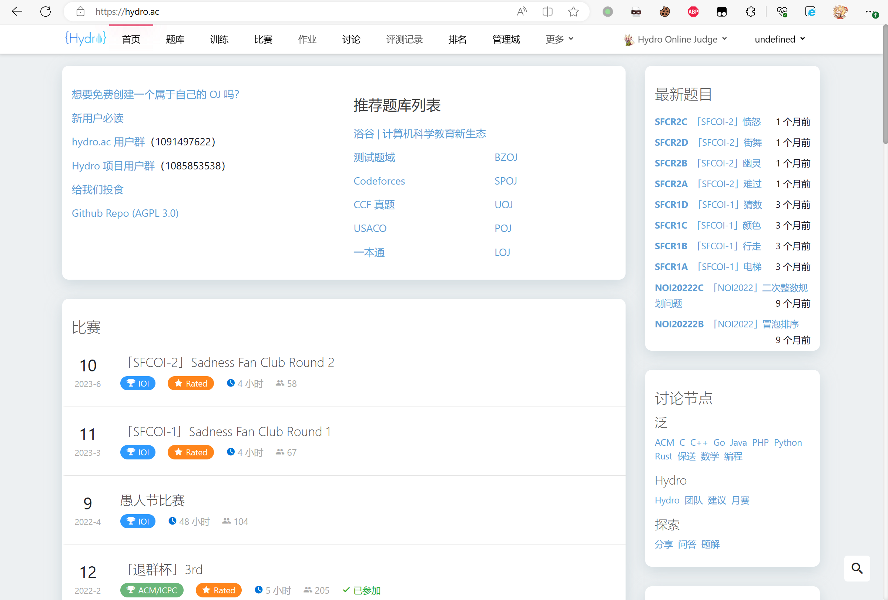
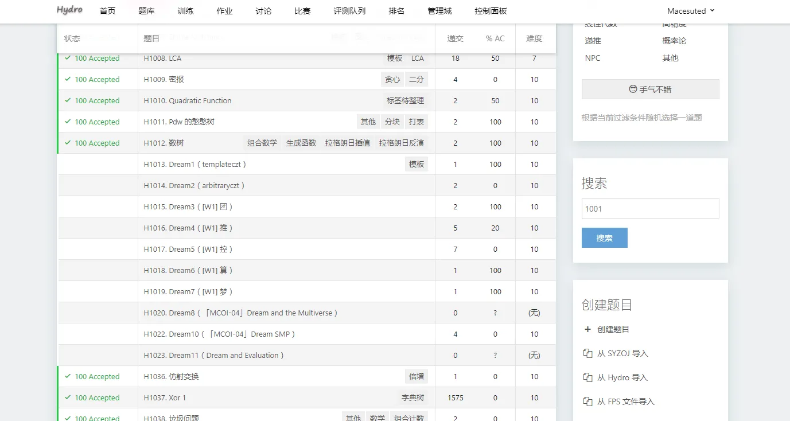
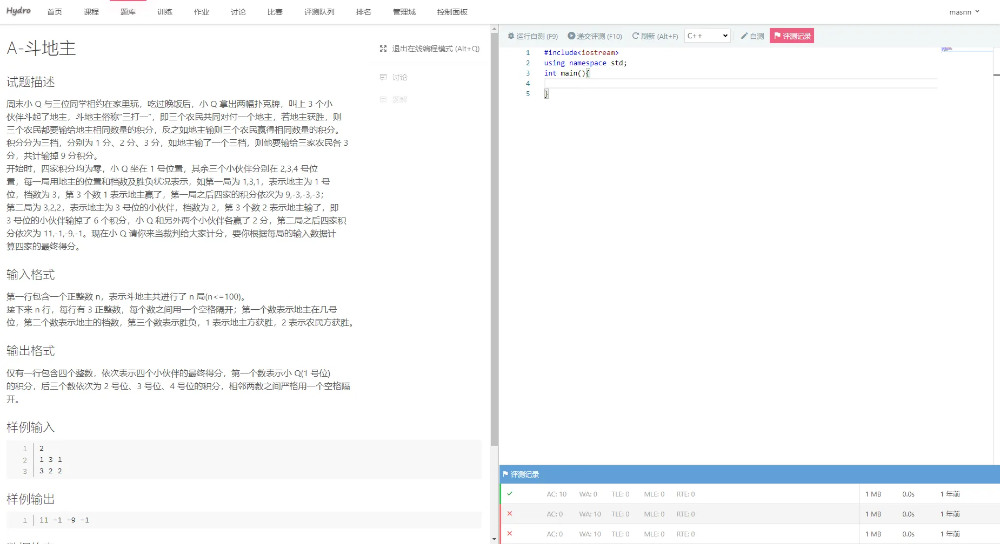
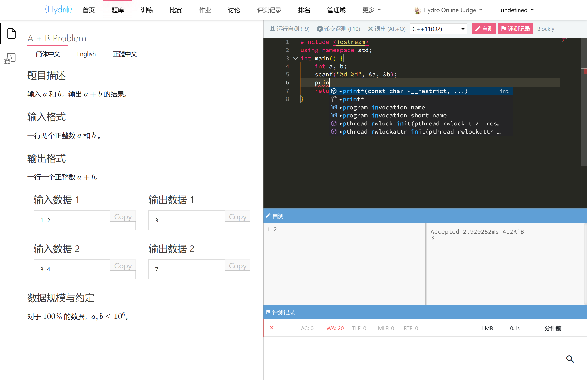

# 介绍

为什么使用 Hydro？

- 安全：使用 cgroup 进行隔离，杜绝卡评测；
- 高效：Hydro 使用了沙箱复用技术，拥有极高的评测效率；
- 扩展：Hydro 支持安装额外模块进行扩展；
- 强大：配合 Judge 模块（或 HydroJudge 独立评测机），可支持 spj，交互题，提交答案题，文件IO 等多种特性；
- 自定：所有权限节点均可自由设置；
- 易上手：无需改动源代码，系统设置中预留了大量可自行修改的内容；管理逻辑简洁；
- 社区：Hydro 正在持续维护中；

- 如果您正在使用 HustOJ，可以导出题目为 FPS 文件后使用 [fps-importer 插件](/plugins/fps-importer) 直接导入 Hydro。
- 如果您正在使用 QDUOJ， 可以导出题目为 QDUOJ-zip 格式后使用 import-qduoj 插件直接导入 Hydro。
- 如果您正在使用 Vijos， 可以直接使用 [migrate-vijos 插件](/plugins/migrate-vijos) 导入所有数据至 Hydro。
- 如果您正在使用 SYZOJ 或是 SYZOJ-NG，可以使用内置的 [Import From SYZOJ 功能](/docs/user/problem/#%E4%BB%8E-syzoj-%E5%AF%BC%E5%85%A5) 将题目导入 Hydro。

- 配合vjudge模块可以实现CodeForces UOJ POJ SPOJ的远程判题
- 配合sonic模块可以实现题目的模糊搜索
- 您可以根据官方提供的插件开发更多插件，自行扩展hydro的功能

## 功能对比

此处对比了 Hydro 与其他主流 OJ 系统的功能。（只进行在不修改源代码情况下的对比）  

```plain
+：支持
=：部分支持
?: 未知
-：不支持
```

|         功能          |          Hydro          |   HustOJ    |    SYZOJ    |   QDUOJ    |  Vijos   |
| :-------------------: | :---------------------: | :---------: | :---------: | :--------: | :------: |
|         安装          |        一键脚本         |  一键脚本   |  手动搭建   |   docker   |  docker  |
|        数据库         |         MongoDB         |    MySQL    |   MariaDB   |  Postgres  | MongoDB  |
|     测试数据存储      |      本地/S3 [^1]       |    本地     |    本地     |    本地    |  数据库  |
|       多评测机        |            +            |      =      |      +      |     +      |    +     |
|     测试数据同步      |        按需抓取         |  全量同步   |  全量同步   |  全量同步  | 按需抓取 |
|         比赛          |       ACM/OI/IOI        | ACM/OI [^2] | ACM/OI/IOI  | ACM/OI/IOI |  ACM/OI  |
|       作业功能        |            +            |      +      |      -      |     -      |    +     |
| 修改编译命令/添加语言 |            +            |      -      |      -      |     -      |    +     |
|     权限系统 [^5]     |            +            |   + [^6]    |      -      |     -      |    +     |
|    训练计划(题单)     |            +            |   - [^7]    |      -      |     -      |    +     |
|         团队          |         + [^3]          |      -      |      -      |     -      |    +     |
|         Hack          |            -            |      -      |      -      |     -      |    -     |
|     SpecialJudge      |         + [^4]          |      +      |      +      |     -      |    -     |
|        Subtask        |            +            |      +      |      +      |     -      |    -     |
|        交互题         |            +            |      -      |      +      |     -      |    -     |
|      RemoteJudge      | Codeforces/SPOJ/UOJ/POJ |      -      |      -      |     -      |    -     |
|       题目导入        |  fps/syzoj/qduoj/hydro  |     fps     |    syzoj    |    fps     |    -     |
|       后端语言        |         NodeJS          |     PHP     |   NodeJS    |   Python   |  Python  |
|       前端框架        |          React          |  BootStrap  | Semantic UI |    Vue     |  React   |

[^1]: S3 指所有兼容 Amazon S3 协议的服务，包括腾讯COS，阿里OSS 等。  
[^2]: 切换比赛模式仅能通过修改设置全局更改。  
[^3]: 通过域功能，允许用户创建域并在域内拥有管理员权限。域之间仅共享账号数据。  
[^4]: 支持所有主流 SPJ 格式。  
[^5]: 此处的权限系统指 除用户/管理员二元化权限之外的 的更细粒度的权限划分。
[^6]: HustOJ的权限管理需要手动操作数据库。
[^7]: 部分第三方修改版提供了该功能，但未开源。  

## 截图






## 现在开始

点击 [部署](/docs/install/) ，开始部署您的 OJ 吧！
