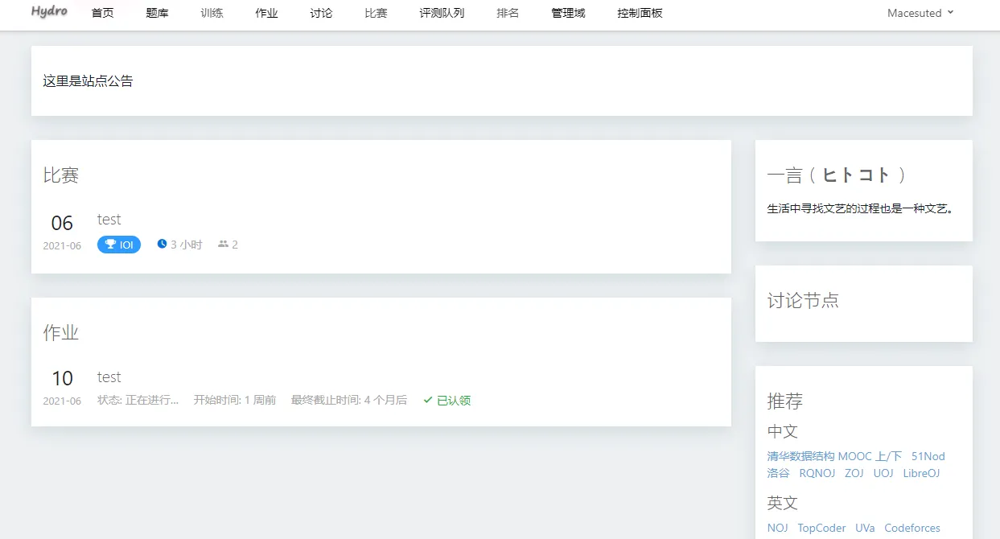
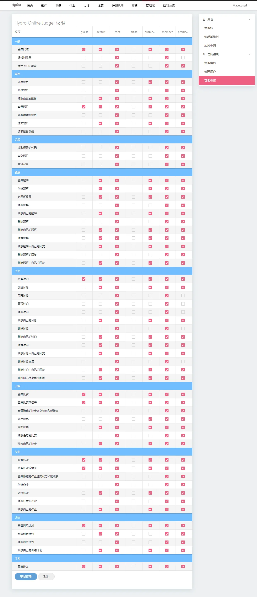

# 介绍

为什么使用 Hydro？

- 安全：使用 cgroup 进行隔离，杜绝卡评测；
- 高效：Hydro 使用了沙箱复用技术，拥有极高的评测效率；
- 扩展：Hydro 支持安装额外模块进行扩展；
- 强大：配合 Judge 模块（或 HydroJudge 独立评测机），可支持 spj，交互题，提交答案题，文件IO 等多种特性；
- 自定：所有权限节点均可自由设置；
- 易上手：无需改动源代码，系统设置中预留了大量可自行修改的内容；管理逻辑简洁；
- 社区：Hydro 正在持续维护中；

- 如果您正在使用 HustOJ，可以导出题目为 FPS 文件后使用 [fps-importer 插件](/plugins/fps-importer) 直接导入 Hydro。
- 如果您正在使用 QDUOJ， 可以导出题目为 QDUOJ-zip 格式后使用 import-qduoj 插件直接导入 Hydro。
- 如果您正在使用 Vijos / SYZOJ / HustOJ / UniversalOJ， 可以直接使用 [migrate 插件](/plugins/migrate) 导入所有数据至 Hydro。

## 功能对比

Hydro 支持很多其他系统无法支持的题型，可在 https://hydro.ac/d/system_test/p 中查看并免费下载使用样例。  
下方对比了 Hydro 与其他主流 OJ 系统的功能。（只进行在不修改源代码情况下的对比）  

```plain
+：支持
=：部分支持
?: 未知
-：不支持
```

|         功能          |         Hydro         |  HustOJ   | SYZOJ[^7]  |   QDUOJ    |  Vijos   |
|:---------------------:|:---------------------:|:---------:|:----------:|:----------:|:--------:|
|         安装          |       一键脚本        | 一键脚本  |  手动搭建  |   docker   |  docker  |
|        数据库         |        MongoDB        |   MySQL   |  MariaDB   |  Postgres  | MongoDB  |
|     测试数据存储      |     本地/S3 [^1]      |   本地    |    本地    |    本地    |  数据库  |
|       多评测机        |           +           |   =[^5]   |   =[^8]    |     =      |    +     |
|     测试数据同步      |       按需抓取        | 全量同步  |  全量同步  |  全量同步  | 按需抓取 |
|         比赛          |    ACM/OI/IOI/乐多    |  ACM/OI   | ACM/OI/IOI | ACM/OI/IOI |  ACM/OI  |
|         封榜          |           +           |     -     |     -      |     -      |    -     |
|       作业功能        |           +           |     +     |     -      |     -      |    +     |
| 修改编译命令/添加语言 |           +           |     -     |     -      |     -      |    +     |
|     权限系统 [^4]     |           +           |     =     |     -      |     -      |    +     |
|    训练计划(题单)     |           +           |     +     |   -[^6]    |     -      |    +     |
|         团队          |        + [^2]         |     -     |     -      |     -      |    +     |
|         Hack          |           +           |     -     |     -      |     -      |    -     |
|     SpecialJudge      |        + [^3]         |     =     |     +      |     -      |    =     |
|        Subtask        |           +           |     -     |     +      |     -      |    -     |
|        交互题         |           +           |     -     |     +      |     -      |    -     |
|      RemoteJudge      | CF/SPOJ/UOJ/POJ/Luogu |     -     |     -      |     -      |    -     |
|       题目导入        | fps/syzoj/qduoj/hydro | fps/qduoj |   syzoj    | fps/qduoj  |    -     |

[^1]: S3 指所有兼容 Amazon S3 协议的服务，包括腾讯COS，阿里OSS 等。  
[^2]: 通过域功能，允许用户创建域并在域内拥有管理员权限。域之间仅共享账号数据。  
[^3]: 支持所有主流 SPJ 格式。  
[^4]: 此处的权限系统指 除用户/管理员二元化权限之外的 的更细粒度的权限划分。  
[^5]: 安装配置繁琐，且需要手动在服务器间同步数据。  
[^6]: 部分二次开发版本有此功能。  
[^7]: SYZOJ 和 Lyrio （曾用名 syzoj-ng，loj.ac 当前所用系统） 是两套不同的系统，这意味着使用 SYZOJ 无法再导入 loj.ac 的题目，同时 Lyrio 无比赛功能。  
[^8]: 需要手动在服务器间同步数据。

## 截图






## 现在开始

点击 [部署](/docs/install/) ，开始部署您的 OJ 吧！
