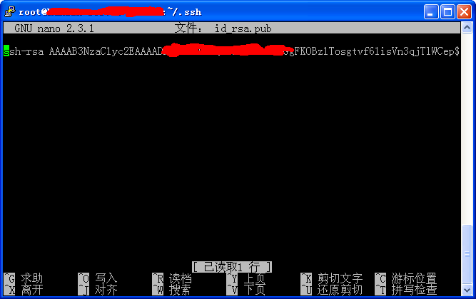
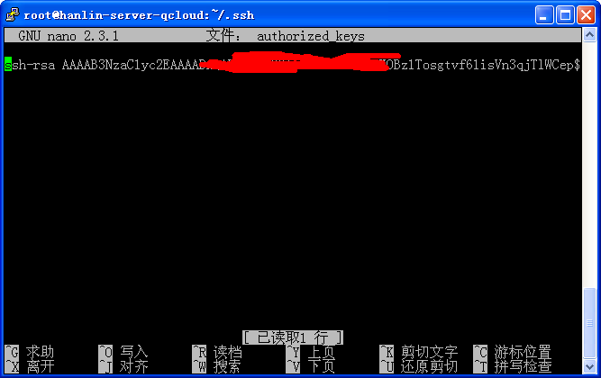

# 端口映射

:::tip
如果您希望让外网访问 Hydro，但是服务器没有外网ip，那么您可能需要这篇教程。  
本文将引导您将内外的 Hydro 对外网开放。您可以选择以下方案中的一种。
:::

## frp 端口转发

可以利用 frp 进行端口转发，仅需要有一台公网 VPS 作为服务端。客户端可以部署在内网的任意一台主机上。

具体的配置文档编写方法可参考 [frp 项目主页](https://github.com/fatedier/frp)。

:::tip
存在一些免费的 frp 转发服务商，您可以在没有公网 VPS 时选择采用他们的服务。请注意自己的信息安全。
:::


## ssh 转发

这个方案需要您有一台 VPS，且 VPS 需要拥有外网 IP。

首先，您需要在本地机器通过 `ssh-keygen` 来生成一个您的密钥：

```bash
ssh-keygen -t rsa
```

一直按 `enter` 键，然后您将会在 `~/.ssh/id_rsa.pub` 取得您的公钥。  


然后登录您的VPS，把上面的公钥扔进`~/.ssh/authorized_keys`，如下图所示：  


现在，您在本地机器上使用如下命令，应该可以免密码登录VPS：  

```sh
ssh <VPS_user>@<VPS_ip>  
```  

如果不能登录，您可能对上面过程的理解存在偏差。  
接下来，在本地机器上安装 autossh，它是稳定的 ssh 连接工具：  

```sh
apt install autossh
```

最后运行下面的指令，将本地的 80 端口映射到 VPS 的 80 端口：  

```sh
autossh -M 5698 -NfR <VPS的ip>:80:<本地机器的ip>:80 <VPS用户名>@<VPS的ip>  

# 例如：
# autossh -M 5698 -NfR 23.23.23.23:80:127.0.0.1:80 blue@23.23.23.23
# 5698 是监听端口，用于测试 ssh 连接是否稳定。如果您运行了多个 autossh，请保证它们的监听端口不同。
```

访问 VPS 的 IP，您应该可以看到 Hydro 了。  
如果您有域名，请添加一条 A 记录，指向 VPS 的 IP，然后就能用域名访问了。


## VPN 方案

这类方案的主要思路是：首先把「位于内网的主机」与「位于公网的 VPS」组建成虚拟网络，再于 VPS 上运行反向代理服务。

组网有多种方式，如 wireguard、OpenVPN、zerotier 等。其中操作最简单的是 zerotier。

反向代理可以通过多种软件实现，如 nginx、socat 等。

从稳定性的角度考虑，笔者推荐 wireguard 组网 + nginx 转发方案。

