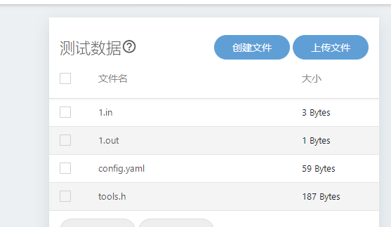
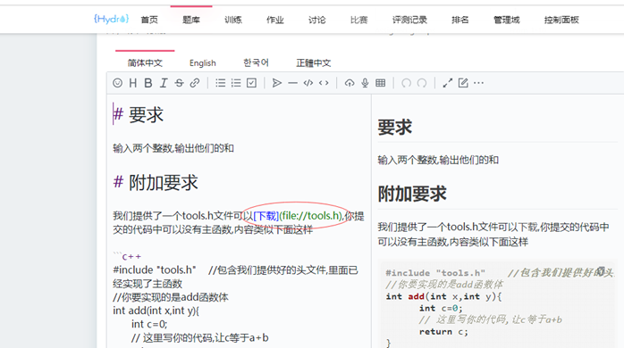
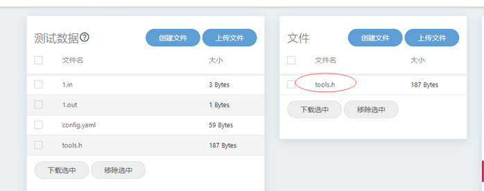
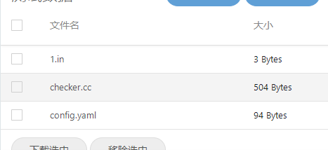
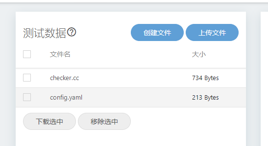
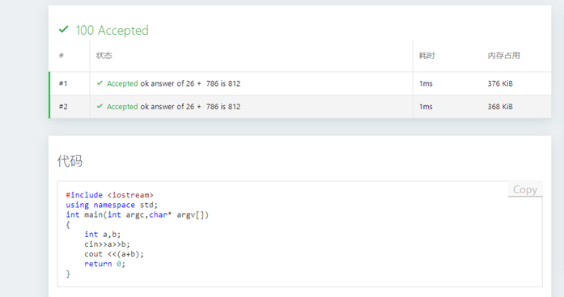
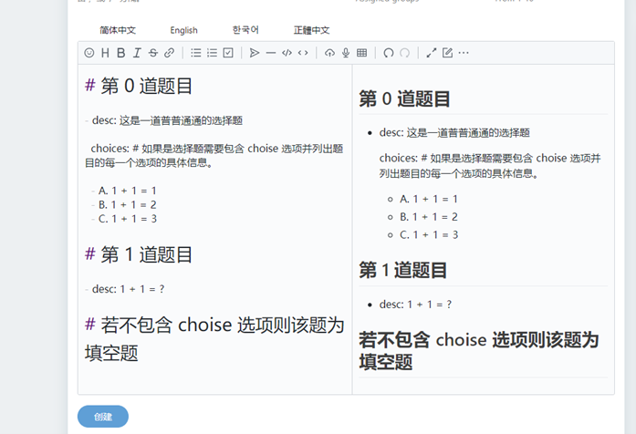
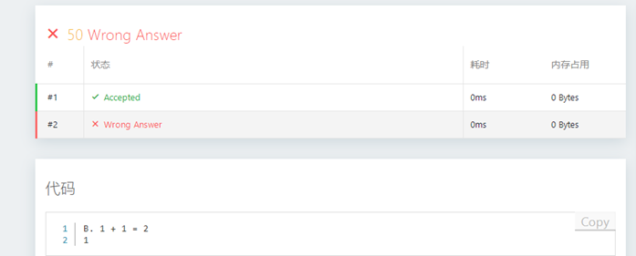

# Hydro常见题型的制做心得

作者: laomai  
qq: 29985091  
网址: http://82.157.98.222:8888/  
日期: 2022/03/16  

本文为作者使用hydro时的实验记录，希望对大家有帮助.包括如下内容

零. hydro题目存储格式  
一. 制做最简单的oj题  
二. 含有自定义头文件的oj题，即函数交互式的题目  
三. 半自动对拍的oj题，即不需要录入预期输出的题  
四. 完全对拍题，即不需要录入输入数据和输出数据的题  
五. 指定输入文件和输出文件  
六. 多个子任务  
七. 客观题，即制做有标准答案的填空和选择题.  

## 零. hydro题目存储格式
如果想在本地建立好题目，然后批量上传的话. 下面的格式应该对你有帮助  
每个题目应自占一个目录，目录名为题目编号比如1 ，2，3，4等等.  
每个题目目录下一般有下面的元素：  
`problem_zh.md` 这个文件是就是题目的内容，即题目的描述，是一个markdown格式的文档.  
`probelm.yaml` 文件.这个是题目的配置信息. 比如标题和标签等。  
testdata 子目录，对应网站里的测试数据部分里的文件，  
里面至少有一个config.yaml文件 用来说明测试的类型.具体内容见后面的例子  
如果题目有测试用例，则每个用例至少要提供一个in文件和一个输出文件(但有些测试类型不用，详情见后)  
additional_file子目录用来存放给做题者用的额外文件，比如头文件，图片，pdf文档等，在题目的 markdown 文档中可以用下面的格式为这些文件提供下载链接：[提示文字](file://xxx.txt)

下面为手工录入各种题型的步骤，即在网站登录后点创建题目之后的操作.如下图所示
 

我们假定题目内容均为下面的markdown文档

    # 要求
    
    输入两个整数，输出他们的和
    
    # 样例
    
    ```input1
    123 500
    ```

    ```output1
    623
    ```

## 一 制做最简单的OJ题目
题目网址: http://82.157.98.222:8888/p/P10000

1. 新建题目之后编辑题目内容，输入题号和标题，然后点创建按钮。如下图所示.
2. 此时出现下面的图，点创建文件，文件名为 `1.in`, 表示用例 1 的输入
3. 编辑 `1.in` 的内容为两个整数比如 2 和 3 ，空格分开，如下图所示，然后点确定
4. 类似办法创建一个 `1.out` 文件，内容为 5 ，注意数字编号必须和 in 文件一致，创建之后的文件列表和下面类似.


5. 这样第一个用例的输入和预期输出就录入完毕，现在可以做本题了
6. 本题的 AC 代码为:

```cpp
#include <iostream>
using namespace std;
int main(int argc,char* argv[]){
    int a,b;
    cin>>a>>b;
    cout <<(a+b);
    return 0;
}
```
 
## 二、函数交互型题目
题目网址: http://82.157.98.222:8888/p/P10001  
本类型和类型一的区别在于出题者要向做题者提供一个额外的头文件，做题者的主函数里可以包含这个头文件以调用出题者提供的某些函数，或者实现头文件里指定的函数.

1. 题目内容的录入以及测试数据的录入和类型一样
2. 本题要额外上传两个文件.分别为 `tools.h` 和 `config.yaml` ，如下图所示
 


`tools.h` 的内容为

```cpp
#include<iostream>
using namespace std;

int add(int x,int y);  //留待做题者实现

int main(int argc,char* argv[]){
    int a,b;
    cin>>a>>b;
    cout << add(a,b);
    return 0;
}
```

这个头文件里实现了一个主函数，并且声明了需要做题者实现的函数add，当然，出题者应该在题目要求里写明这个函数的原型以及把tools.h文件上传到附加文件列表中，以方便做题者.  
题面里可以用如下格式为用户提供下载链接，中括号内的内容可以自己写，[tools.h](file://tools.h) 如下面所示





config.yaml文件的内容为
```yaml
type: default
filename: null
user_extra_files:
  - tools.h
```

本题的ac代码为

```cpp
#include "tools.h"
int add(int x,int y){
    return x+y;
}
```

可见本类型的题目，做题者包含给定的头文件后，可以不需要自己实现主函数，只需要专心实现给定的函数即可.

## 三,半对拍-自己指定评测程序并修改测试输出格式
例题网址:http://82.157.98.222:8888/p/P10002  
本题型的特点是不需要手工给出每个用例的预期输出，但是要自己编写一个样本程序,测试时会把用户的输出和样本程序的输出进行对比。

仍以两数求和为例

1. 题目内容和类型一类似
2. 测试数据部分只需要提供1.in
3. 编写一个样本程序 `checker.cc`，内容如下:

```cpp
#include "testlib.h"
int main(int argc, char * argv[]) {
    registerTestlibCmd(argc, argv);
    int a = inf.readInt();   // 读取输入流的第一个整数
    int b = inf.readInt();   // 读取输入流的下一个整数
    int d = a+b;
    int c = ouf.readInt();   // 读取输出流的下一个整数
    if (a+b != c)
        quitf(_wa, "%d + %d expected %d, found %d", a, b,d,c);   //输出错误的具体信息,便于做题者调试
    else
        quitf(_ok, "answer of %d +  %d is %d",a,b,c);
}
```

4. config.yaml文件的内容如下:

```yaml
checker_type: testlib
checker: checker.cc
cases:
  - input: 1.in
    output: /dev/null # 无输出
```

最终的测试文件列表如下所示:



当程序有错误时,输出的效果如下

可见这里输出了错误细节,便于做题者调试

本题的ac代码和类型一的一样,内容为

```cpp
#include <iostream>
using namespace std;
int main(int argc,char* argv[]){
    int a,b;
    cin>>a>>b;
    cout <<(a+b);
    return 0;
}
```
 
# 四. 全自动对拍题
如果不希望自己录入输入数据,而是在每次测试时自动动态生成的话,可以将题目类型设为`interactive`,并提供一个对拍程序.仍以求和为例  
例题网址: http://82.157.98.222:8888/p/P10005

最后测试数据部分的文件列表如下图所示


 
1. `checker.cc`,内容为:

```cpp
#include "testlib.h"
#include <iostream>
using namespace std;

int main(int argc, char* argv[]) {
    setName("Interactor A+B");
    registerInteraction(argc, argv);
    //自动生成两个随机整数
    rnd.setSeed(time(NULL));
    int a = rnd.next(1000);
    int b = rnd.next(1000);
    int d = a+b;
    // 本程序的输出将作为用户程序的输入
    cout << a << " " << b << endl;
    int c;
    // 用户程序的最后输出将作为本程序的输入
    cin >> c;
    //对比用户结果和预期结果
    if (a+b != c)
        quitf(_wa, "%d + %d expected %d, found %d", a, b,d,c);   //输出错误的具体信息,便于做题者调试
    else
        quitf(_ok, "answer of %d +  %d is %d",a,b,c);
}
```

2. `config.yaml` 文件的内容为:

```yaml
type: interactive
interactor: checker.cc
cases:
- input: /dev/null # no input and no output, dynamic generated
  output: /dev/null
- input: /dev/null # no input and no output, dynamic generated
  output: /dev/null
```



AC 代码和类型一中的相同

## 五.文件读写测试
例题网址:http://82.157.98.222:8888/p/P10003  
有时希望指定输入和输出文件，此时测试文件 `1.in` 和 `1.out` 和类型一类似,
但是要提供config.yaml文件，内容类似于下

```yaml
file: test
```

则运行时测试环境会自动把每个输入文件复制到test.in中,输出内容和test.out的内容进行对比.
ac的代码如下:

```cpp
#include <fstream>
using namespace std;
int main(int argc,char* argv[]){
    int a,b;
    ifstream ifs("test.in");
    ifs>>a>>b;
    ofstream ofs("test.out");
    ofs <<(a+b);
    return 0;
}
```
 
## 六,子任务测试.
例题网址: https://hydro.ac/d/system_test/p/7
1. 提供好题目和各个子任务的输入、输出文件 建议文件名格式为 `data<id>-<数字>` id为子任务编号
2. config.yaml文件的内容参考如下

```yaml
time: 100ms
memory: 8m
subtasks:
  - score: 20
    id: 0
    cases:
      - input: data1-1.in
        output: data1-1.ans
      - input: data1-2.in
        output: data1-2.ans
      - input: data1-3.in
        output: data1-3.ans
      - input: data1-4.in
        output: data1-4.ans
      - input: data1-5.in
        output: data1-5.ans
  - score: 20
    id: 1
    cases:
      - input: data2-1.in
        output: data2-1.ans
      - input: data2-2.in
        output: data2-2.ans
      - input: data2-3.in
        output: data2-3.ans
      - input: data2-4.in
        output: data2-4.ans
      - input: data2-5.in
        output: data2-5.ans
  - score: 20
    id: 2
    cases:
      - input: data3-1.in
        output: data3-1.ans
      - input: data3-2.in
        output: data3-2.ans
      - input: data3-3.in
        output: data3-3.ans
      - input: data3-4.in
        output: data3-4.ans
      - input: data3-5.in
        output: data3-5.ans
  - score: 20
    id: 3
    if: [2]
    cases:
      - input: data4-1.in
        output: data4-1.ans
      - input: data4-2.in
        output: data4-2.ans
      - input: data4-3.in
        output: data4-3.ans
      - input: data4-4.in
        output: data4-4.ans
      - input: data4-5.in
        output: data4-5.ans
  - score: 20
    id: 4
    if: [1, 3]
    cases:
      - input: data5-1.in
        output: data5-1.ans
      - input: data5-2.in
        output: data5-2.ans
      - input: data5-3.in
        output: data5-3.ans
      - input: data5-4.in
        output: data5-4.ans
      - input: data5-5.in
        output: data5-5.ans
```

可以看出if 用来指定前置子任务.    
此外,如果某个子任务没有提供cases部分时,测试时会自动寻找类似于 `data<id>-x.in` 和`data<id>-x.out` 的文件,id为子任务编号    
上面的例子故意设计为子任务编号和用例文件中的编号不同,所有每个子任务都需要手工指定对应的cases.

 
## 七,客观题制做
> 注意新版的客观题，格式已经更新。

例题网址:http://82.157.98.222:8888/p/P10004  
客观题只需要题面和config.yaml文件.
例子如下:

```yaml
1. 填空题

1+1 = {{ input(1) }}

2. 选择题

{{ select(2) }}
- 1+1=2
- 1+1=3
- 1+1=4

3. 多选题

{{ multiselect(3) }}
- A
- B
- C

```



上传的 `config.yaml` 内容为

```yaml
type: objective # 表明该题为客观题
answers: # 列举出每一题的正确选项与对应的得分
  '1': ['2', 50]
  '2': [['A', 'B'], 30] # 填空题支持多答案，满足其一得分
  '3': [['A', 'B'], 20] # 多选题答案为数组，有部分分

```

题目运行效果如下：
 


做完之后点提交,效果如下



可见评分结果正确.

## 八.小结
对所有编程题目,题面是必须录入的,如果指定了测试程序时,可以不需要录入输出数据.  
如果设置测试方式为interactive,输入数据也不需要手工录入.  
想指特殊的测试方式时,一般需要上传一个config.yaml文件,并设置对应字段的值.  
对编程题,本文档中用到的字段有

type字段一般为default, 对全自动对拍题,设为interactive

checker_type: testlib
checker: checker.cc
用来指定自定义的测试程序,即对拍程序

filename: test用来指定对test.in文件和test.out文件进行读写.

cases:
  - input: 1.in

用来指定测试用例.

更详细的介绍见
https://hydro.js.org/docs/user/testdata/


