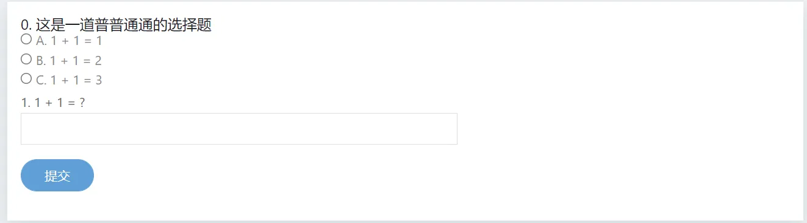

# 题目

## 创建题目

拥有 PERM_CREATE_PROBLEM 的用户均可以新建题目。  
请点击题库页面右下角的 `创建题目` 按钮。

:::tip
题目 ID 不能全为数字。若留空则使用自动分配的数字题号。
:::

## 导入题目

### 从 Hydro 导入

上传 Hydro 导出的题目压缩包即可。

### 从 SYZOJ 导入

在“导入自”一栏中填入要导入的题目的 URL（源站必须基于原版 SYZOJ/SYZOJ-NG 搭建），然后点击“导入”键即可。  
题目除测试数据以外的部分会直接导入，测试数据将会异步导入（取决于网络状况，这可能需要一段时间，请耐心等待）。  

### 从 FPS 文件导入

见插件 [fps-importer](/plugins/fps-importer/)。

### 从 QDUOJ 导入

见插件 import-qduoj。
<!-- TODO -->

## 编辑

### 题面

题面使用 Markdown 语法，并进行了部分扩展。  

支持对样例数据分组显示：

<pre><code>```input1
1 2
```

```output1
3
```</code></pre>

后接的数字为测试点编号，将自动合并，并左右分栏显示。

支持从附加文件引用资源。（您可以先创建题目，上传相关文件后再编辑该题目）

- 附加文件下载链接： `[file](file://input.in)`
- 从附加文件引用一张图片： ``
- 从附加文件引用 pdf 作为题面：`@[pdf](file://foo.pdf)` （该功能在部分环境可能不正常。请考虑使用 [hydro-pdf](https://github.com/Ri-moe/hydro-pdf) 插件。）
- 从附加文件引用 word 文档作为题面： `@[doc](file://foo.docx)` （依赖 onlyoffice 插件）
<!-- TODO -->

题面支持合并表格：

```markdown
| 1   | 1   | 3   | 4   | 5   |
| --- | --- | --- | --- | --- |
| 1   | 1   | 2   | 2   | 6   |
| 1   | 1   | 2   | 2   | 7   |
| 1   | 4   | 3   | 5   | 5   |
```

将被渲染为：


支持内嵌 HTML：（用来对付部分 Markdown 搞不定的东西）

```markdown
<span bgcolor="red">foo</span>
```

### 标签

可点击右侧分类面板快速添加标签，也可以用英文半角逗号分隔多个标签。

## 文件

您可以在题目右侧“文件”面板上传测试数据和附加文件。（支持拖拽文件至相应位置进行上传）  
[测试数据格式](/docs/user/testdata)。

## 客观题

由于客观题的题面和测试数据配置均与其他题目不同，所以这里单独给出配置客观题的方法。

### 题面

题面需要以 yaml 格式给出。

```yaml
# 第 0 道题目
- desc: 这是一道普普通通的选择题
  choices: # 如果是选择题需要包含 choise 选项并列出题目的每一个选项的具体信息。
  - A. 1 + 1 = 1
  - B. 1 + 1 = 2
  - C. 1 + 1 = 3
# 第 1 道题目
- desc: 1 + 1 = ?
# 若不包含 choise 选项则该题为填空题
```

上面这个例子对应的题面为：



### 测试数据

仅需要配置 config.yaml 即可，不需要上传其他文件。

```yaml
type: objective # 表明该题为客观题
outputs: # 列举出每一题的正确选项与对应的得分
  - [B. 1 + 1 = 2, 50]
  - ['2', 50]
```
